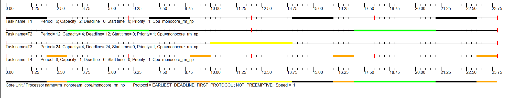

# Mode 1 (tâches périodiques indépendantes)

## Exemples à tester :

## Rate Monotonic :
### Exemple 1:

### Exemple 2:

### Exemple 3:

Exemple 3 n'est pas ordonnançable avec RM !

### Exemple 4:

## Earliest Deadline First :
### Exemple 1:

### Exemple 2:

### Exemple 3:

Exemple 3 n'est pas ordonnançable avec EDF !

### Exemple 4:

