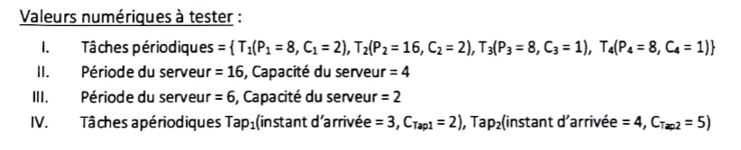
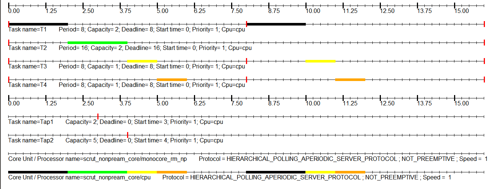
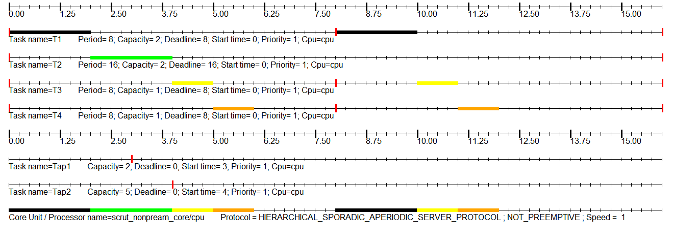
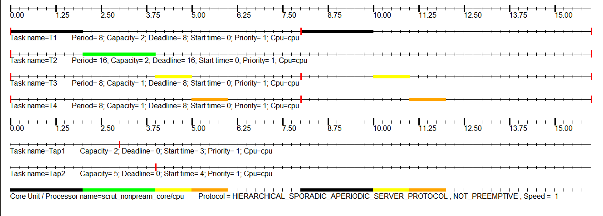

# Mode 2 (tâches périodiques indépendantes)

## Serveur à scrutation :
### Période de 16, Capacité de 4

### Période de 6, Capacité de 2

## Serveur sporadique :
### Période de 16, Capacité de 4

### Période de 6, Capacité de 2

