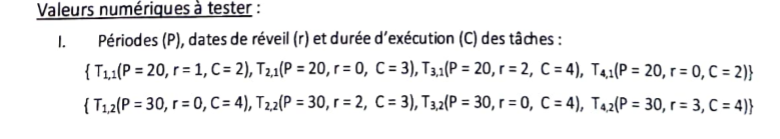
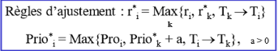
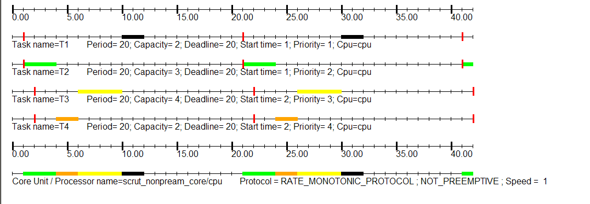
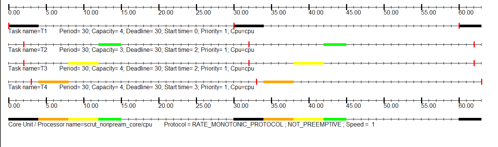
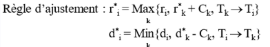
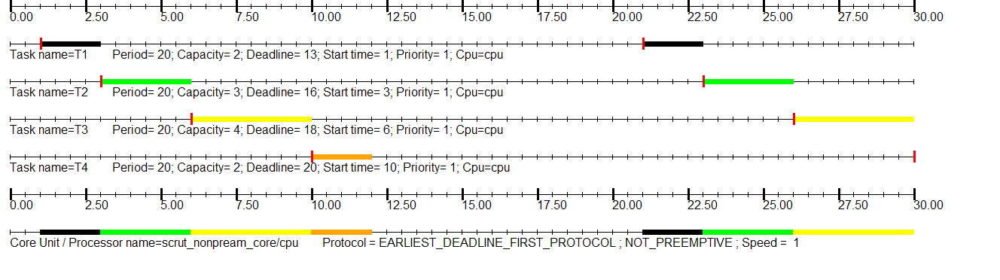
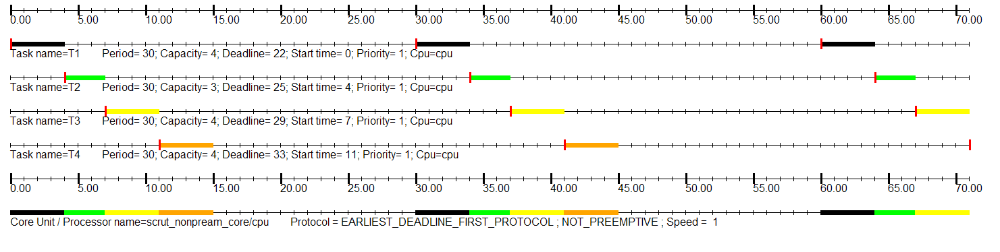

# Mode 3 (tâches périodiques dépendantes)

## Rate Monotonic avec précédence:
Règle de transformation :  

### Cas n°1:

### Cas n°2:

## Earliest Deadline First avec précédence:
Règle de transformation :  

### Cas n°1:

### Cas n°2:
